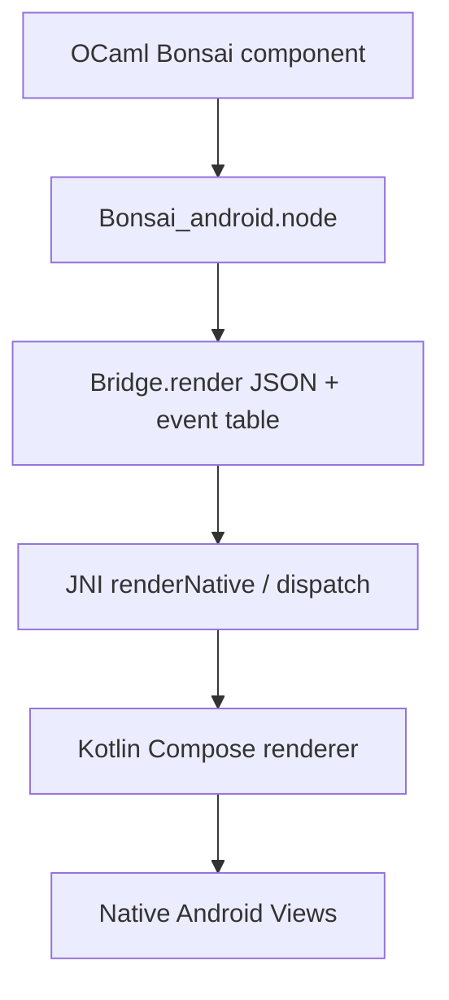

# bonsai-android

Native Android UI experiments for Bonsai.

The UI is authored in OCaml:

```ocaml
let component graph =
  let open Bonsai.Let_syntax in
  let count, set_count = Bonsai.state 0 graph in
  let%arr count and set_count in
  Bonsai_android.vstack
    [ Bonsai_android.text ("Count: " ^ Int.to_string count)
    ; Bonsai_android.button "Increment" ~on_click:(set_count (count + 1))
    ]
```

Kotlin/Jetpack Compose is only the Android rendering backend. It consumes the
OCaml node tree and sends event ids back to OCaml through JNI.

## Current status

- Shared OCaml DSL and Android node JSON bridge are implemented in
  `bonsai_native`.
- Jetpack Compose host renders the node JSON contract.
- JNI names are defined for an OCaml-produced native library and dispatch
  events back through the Bonsai driver.
- Android Gradle app builds and runs without the OCaml `.so` by rendering an
  OCaml-generated fallback asset.

The missing production step is an Android OCaml cross switch that builds
`libbonsai_android_counter.so` and copies it into:

```text
android/_build/android/jniLibs/arm64-v8a/libbonsai_android_counter.so
```

## Build checks

OCaml host smoke build:

```sh
export BONSAI_ANDROID_OPAM_SWITCH=/Users/tiensonqin/Codes/projects/bonsai-apple
opam exec --switch="$BONSAI_ANDROID_OPAM_SWITCH" -- dune build
```

Regenerate the checked Android fallback asset from the OCaml counter:

```sh
BONSAI_ANDROID_OPAM_SWITCH=/Users/tiensonqin/Codes/projects/bonsai-apple \
  scripts/generate-android-assets.sh
```

Android shell build:

```sh
cd android
./gradlew :app:assembleDebug
```

Emulator smoke test:

```sh
scripts/test-android-emulator.sh
```

The default AVD is `Medium_Phone_API_36.1`. Override it with:

```sh
BONSAI_ANDROID_AVD=<your-avd-name> scripts/test-android-emulator.sh
```

If `emulator -list-avds` hangs or `sdkmanager` is missing, install/repair the
official Android command-line tools in `$ANDROID_HOME/cmdline-tools/latest` and
then run:

```sh
yes | "$ANDROID_HOME/cmdline-tools/latest/bin/sdkmanager" --licenses
"$ANDROID_HOME/cmdline-tools/latest/bin/sdkmanager" --install "emulator"
```

## Architecture



This keeps app UI in OCaml while still using real native Compose widgets on
Android.

## Native event path

When `libbonsai_android_counter.so` is present, Android calls:

- `renderNative()` to get the current Bonsai-rendered node tree.
- `dispatchClickNative(eventId)` for button events.
- `dispatchChangeNative(eventId, text)` for text field events.

OCaml owns the event table and schedules `Bonsai.Effect.t` values on the
`Bonsai_driver`. The next render flushes the driver and sends the updated tree
back to Compose.
